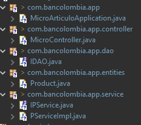

# Notas Curso Microservicio

## En este archivo encontrará la ayuda para crear los microservicios del curso

- [Microservicio articulo](#microservicio-articulo)

- [Microservicio carrito](#microservicio-carrito)

- [Microservicio eureka](#microservicio-eureka)

- [Microservicio Gateway](#microservicio-gateway)


# Microservicio articulo
## [regresar](#notas-curso-microservicio)
## Dependencias usadas
- Spring Web
- MySQL Driver
- Spring Data JPA
- Spring Dev Tools
- Eureka Discovery Client

## Estructura del proyecto
- [Product.java](#código-clase-productjava-regresar)
- [DAO](#código-interface-dao-regresar)

- [Servicio interface](#código-interface-servicio-regresar)

- [Servicio Implementación](#código-implementación-servicio-regresar)

- [Controlador](#código-controlador-regresar)
<br>
<br>



## application.properties

```properties
spring.application.name=micro-articulo
server.port=${PORT:8081}

#hibernate config
spring.jpa.properties.hibernate.dialect=org.hibernate.dialect.MySQL8Dialect
spring.jpa.hibernate.ddl-auto=update

#database config
spring.datasource.url=jdbc:mysql://${IPDB:localhost}:3306/micro1
spring.datasource.username=${DBUSER:root}
spring.datasource.password=${DBPASS:1234}

#eureka config
eureka.client.service-url.defaultZone=http://${IPEUREKA:localhost}:9999/eureka
```

## Código Clase Product.java [regresar](#estructura-del-proyecto)

```java
package com.bancolombia.app.entities;

import jakarta.persistence.Column;
import jakarta.persistence.Entity;
import jakarta.persistence.GeneratedValue;
import jakarta.persistence.GenerationType;
import jakarta.persistence.Id;
import jakarta.persistence.Table;

@Entity
@Table(name="products")
public class Product {
	@Id
	@GeneratedValue(strategy = GenerationType.IDENTITY)
	private int id;
	@Column(length = 50)
	private String name;
	@Column(length=50)
	private String brand;
	public int getId() {
		return id;
	}
	public void setId(int id) {
		this.id = id;
	}
	public String getName() {
		return name;
	}
	public void setName(String name) {
		this.name = name;
	}
	public String getBrand() {
		return brand;
	}
	public void setBrand(String brand) {
		this.brand = brand;
	}
	
	

}
```

## Código interface DAO [regresar](#estructura-del-proyecto)

```java
package com.bancolombia.app.dao;

import org.springframework.data.repository.CrudRepository;

import com.bancolombia.app.entities.Product;

public interface IDAO extends CrudRepository<Product, Integer> {

}
```

## Código interface Servicio [regresar](#estructura-del-proyecto)

```java
package com.bancolombia.app.service;

import java.util.List;

import com.bancolombia.app.entities.Product;

public interface IPService {
	Product insert(Product pr);
	List<Product> getAll();
	Product findById(int id);

}

```

## Código implementación Servicio [regresar](#estructura-del-proyecto)

```java
package com.bancolombia.app.service;

import java.util.List;

import org.springframework.beans.factory.annotation.Autowired;
import org.springframework.stereotype.Service;

import com.bancolombia.app.dao.IDAO;
import com.bancolombia.app.entities.Product;

@Service
public class PServiceImpl implements IPService {
	
	@Autowired
	private IDAO dao;

	@Override
	public Product insert(Product pr) {
		
		return dao.save(pr);
	}

	@Override
	public List<Product> getAll() {
		
		return (List<Product>)dao.findAll();
	}

	@Override
	public Product findById(int id) {
		
		return dao.findById(id)
				.orElseThrow();
	}
	
	
	

}

```


## Código controlador [regresar](#estructura-del-proyecto)
```java
package com.bancolombia.app.controller;

import java.util.List;

import org.springframework.beans.factory.annotation.Autowired;
import org.springframework.web.bind.annotation.GetMapping;
import org.springframework.web.bind.annotation.PathVariable;
import org.springframework.web.bind.annotation.PostMapping;
import org.springframework.web.bind.annotation.RequestBody;
import org.springframework.web.bind.annotation.RequestMapping;
import org.springframework.web.bind.annotation.RestController;

import com.bancolombia.app.entities.Product;
import com.bancolombia.app.service.IPService;

@RestController
@RequestMapping("/product")
public class MicroController {
	
	@Autowired
	private IPService service;
	
	@PostMapping
	public Product insert(@RequestBody Product pr) {
		return service.insert(pr);
	}
	
	@GetMapping("/{id}")
	public Product findById(@PathVariable("id") int id) {
		return service.findById(id);
	}
	
	@GetMapping
	public List<Product> findAll(){
		return service.getAll();
	}
}

```

# Microservicio carrito
## [regresar](#notas-curso-microservicio)

## Dependencias
- Spring Web
- Open Feig
- Spring Dev Tools
- Eureka discovery Client

## application.properties

```properties
spring.application.name=micro-carrito
server.port=${PORT:8082}

#eureka config
eureka.client.service-url.defaultZone=http://${IPEUREKA:localhost}:9999/eureka
```


# Microservicio eureka
## [regresar](#notas-curso-microservicio)
## Dependencias
- EurekaServer
- Spring dev Tools

## application.properties

```properties
spring.application.name=micro-eureka
server.port=9999

#Desactivamos el cliente de eureka
eureka.client.register-with-eureka=false
eureka.client.fetch-registry=false
eureka.server.maxThreadsForPeerReplication=0
```


# Microservicio Gateway
## [regresar](#notas-curso-microservicio)

## Dependencias
- Eureka Discovery Client
- Spring Dev Tools
- Reactive Gateway

## application.properties

```properties
spring.application.name=micro-gateway
server.port=${PORT:8084}


eureka.client.service-url.defaultZone=http://${IPEUREKA:localhost}:9999/eureka

#path configuration
spring.cloud.gateway.discovery.locator.enabled=true
spring.cloud.gateway.discovery.locator.lower-case-service-id=true
```